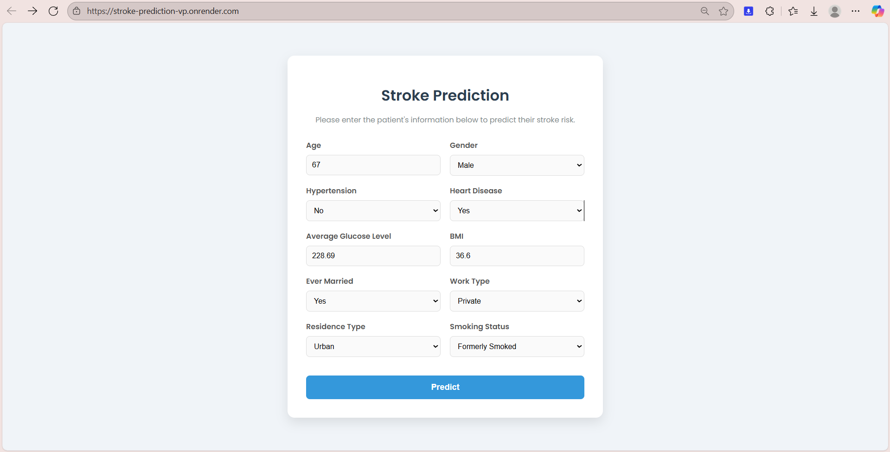
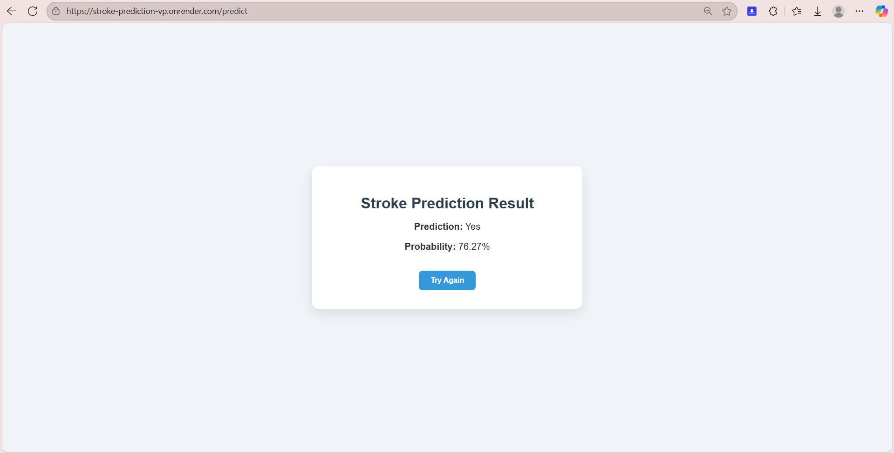

# 🧠 Stroke Prediction Using Machine Learning

This is **end-to-end machine learning project** that predicts the likelihood of a stroke based on patient health and lifestyle data.  
The system uses **feature engineering**, **Random Forest tuning**, and an **advanced stacking ensemble** for accurate predictions, and is deployed as a **Flask web app** for real-time usage.

---

## 🌍 Live Demo
👉 [Try the Stroke Prediction App](https://stroke-prediction-vp.onrender.com/)  

---

## 📖 Overview
Stroke is one of the leading causes of death and disability worldwide.  
This project predicts stroke risk using demographic, medical, and lifestyle data.  
Key steps include:
- Data preprocessing and cleaning
- Feature selection
- Class balancing (undersampling)
- Random Forest hyperparameter tuning
- Advanced Stacking Ensemble for final prediction
- Flask web app for deployment

---

## ✨ Features
- **Data Preprocessing**  
  - Missing value imputation for BMI  
  - Outlier capping for BMI  
  - Encoding categorical variables  
  - Scaling numerical features  

- **Feature Selection**  
  - Used Recursive Feature Elimination (RFE) with RandomForest to identify the most important predictors

- **Class Balancing**  
  - Applied **Random Undersampling** to ensure balanced representation

- **Model Training**  
  - Tuned Random Forest with GridSearchCV  
  - Combined multiple models (RandomForest, Bagging, Gradient Boosting)  
  - Logistic Regression used as meta learner in Stacking Ensemble  

- **Deployment**  
  - Flask backend with HTML frontend  
  - Live deployment on **Render**  

---

## 📊 Dataset
**Source**: [Kaggle Stroke Prediction Dataset](https://www.kaggle.com/datasets/fedesoriano/stroke-prediction-dataset)  

Attributes include:
- Demographics: Gender, Age, Residence Type, Marital Status, Work Type  
- Medical history: Hypertension, Heart Disease  
- Health metrics: Average Glucose Level, BMI  
- Lifestyle: Smoking Status  
- Target: Stroke (1 = Yes, 0 = No)  

---

## 🧮 Machine Learning Pipeline
1. **Data Cleaning**: Handled missing values and capped outliers.  
2. **Encoding & Scaling**: Encoded categorical variables, applied Min-Max scaling to numerical features.  
3. **Feature Selection**: Selected key predictors using RFE.  
4. **Balancing**: Used undersampling.  
5. **Model Training**: Tuned RandomForest and built a Stacking Ensemble with Bagging and Gradient Boosting.  
6. **Evaluation**: Measured accuracy, precision, recall, and F1-score.  
7. **Deployment**: Integrated trained model into a Flask web application.  

---

## 📈 Final Model Performance — 
**Classification Report:**
```
               precision    recall  f1-score   support

           0       0.85      0.69      0.76        51
           1       0.73      0.88      0.80        49

    accuracy                           0.78       100
   macro avg       0.79      0.78      0.78       100
weighted avg       0.79      0.78      0.78       100
```

**Highlights:**
- **Recall for stroke cases (1)** = **0.88** → Strong detection of positive cases  
- Balanced performance across classes  
- Final accuracy = **78%** on test set  

---

## 🖥 Tech Stack
- **Python 3.x**  
- **Flask**  
- **scikit-learn**  
- **imbalanced-learn**  
- **pandas**, **numpy**  
- **matplotlib**, **seaborn**  
- **HTML (templates)**  
- **Render (Deployment)**  

---

## 📂 Project Structure
```
├── app.py                         # Flask backend
├── all_assets.pkl                  # Trained model & preprocessing pipeline
├── healthcare-dataset-stroke-data.csv
├── Stroke_Prediction.ipynb         # Notebook for training & analysis
├── requirements.txt                # Dependencies
├── templates/
│   ├── index.html                  # Input form page
│   └── result.html                 # Output result page
├── screenshots/
│   ├── form.png                    # Input form screenshot
│   └── result.png                  # Prediction result screenshot
```

---

## ▶️ Usage
```bash
python app.py
```
The app will run locally at:  
`http://127.0.0.1:5000/`  

Or try the **live deployed app** here:  
👉 [Stroke Prediction on Render](https://stroke-prediction-vp.onrender.com/)

---

## 📸 Screenshots
### Input Form


### Prediction Result


---

## 🔮 Future Improvements
- Add batch prediction from CSV  
- Deploy to multiple cloud providers  
- Store predictions in a database  
- Add real-time health monitoring API integration

## 📬 Contact

- [LinkedIn](https://www.linkedin.com/in/vaibhav-pratap-singh-nitjsr)

---

⭐ **If you found this project insightful, consider giving it a star!**